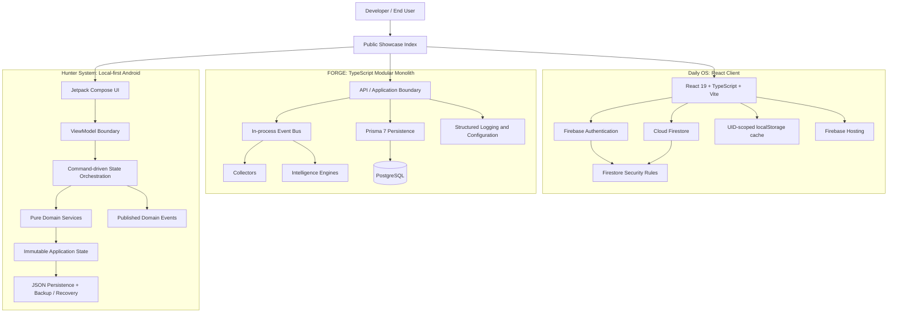

  

  
  
  

# Showcase & Architecture Index

## 01 // Overview & Purpose

This repository is a **Public Engineering Showcase & Architecture Index** for a portfolio of systems being developed across web, data, and Android domains. It is intentionally organized around technical proof: architecture decisions, system boundaries, implementation phases, and verifiable deliverables.

While the proprietary codebases remain in private development, this public index gives verified recruiters, faculty advisors, and engineers direct access to the documented system designs, API and data-model direction, technology choices, and verified delivery reports. The linked project repositories provide the next level of implementation detail where they are already public.

**Repository evidence:** this workspace currently contains three build reports and no application source tree, package manifest, container definition, or deployment configuration. The stack descriptions below are therefore derived from those reports and are presented as architecture and progress evidence, not as a claim that all source code is mirrored here.

## 02 // Index Of Active Projects / Modules

| Project Name | Detected Architecture / Stack | Current Phase Status | Public Artifact Placeholders |
| --- | --- | --- | --- |
| [Daily OS](https://github.com/VarunS-03/DailLogOS) | React 19 + TypeScript + Vite; Firebase Authentication; Cloud Firestore; Firebase Hosting; Tailwind CSS; `lucide-react`; `motion` | Active Development; Phase 1 complete. Current target: reproducible Firebase deployment, security configuration, and verified live demo. | Case Study: not published · Loom Demo: not available · Staging: not available |
| [FORGE](https://github.com/VarunS-03/FORGE) | TypeScript + Node.js modular monolith; pnpm workspaces; ES modules; Vitest; Prisma 7; PostgreSQL; in-process event bus | Active Development; Phase 1 complete. Current target: domain schemas, migrations, repositories, and CRUD validation. | Case Study: not published · Loom Demo: not available · Staging: not available |
| [Hunter System](https://github.com/VarunS-03/huntersystem) | Kotlin Android; Jetpack Compose; Material 3; ViewModel; Coroutines; Moshi; local JSON persistence; JUnit 4; Robolectric; Roborazzi | Active Development; Phase 1 complete. Current target: MVP readiness and productization audit. | Case Study: not published · Loom Demo: not available · Staging: not applicable for local-first Android app |

## 03 // System Architecture Diagram

The three systems demonstrate distinct delivery patterns: a hosted, user-scoped Firebase client; an event-ready TypeScript intelligence platform backed by PostgreSQL; and a resilient local-first Android application with deterministic domain logic.

## 04 // Monthly Engineering Milestones (August)

Open August delivery record

### Showcase repository

- Established the Phase 0 setup record on August 27, 2026.
- Added the Phase 1 DSA / LeetCode `day0.md` record on August 28, 2026.
- The Phase 0 and Phase 1 records were later removed from the current tree, preserving a concise public index of the three project reports.

### Daily OS

- Defined a React 19 and TypeScript client architecture using Vite.
- Documented Firebase Authentication, Cloud Firestore, Firebase Hosting, UID-scoped local caching, and deny-by-default user isolation through Firestore Security Rules.
- Documented validated backup import, environment-based Firebase configuration, optional Firebase App Check, and typed application state as release requirements.

### FORGE

- Moved from architectural documentation into a TypeScript monorepo foundation with pnpm workspaces, strict TypeScript, ES modules, and Vitest.
- Implemented typed configuration, structured logging with sensitive-value redaction, an immutable event model, and an in-process event bus.
- Added the initial Prisma 7 and PostgreSQL persistence configuration and established application, package, collector, and engine boundaries.

### Hunter System

- Implemented the core quest lifecycle, progression, daily activity, streak, reward economy, and achievement systems.
- Built the single-screen Jetpack Compose dashboard with ViewModel-based state orchestration.
- Established local JSON persistence with backup and recovery behavior and documented 78 test methods across unit, integration, screenshot, Robolectric, and instrumented test sources.

## 05 // Verification & Contact

The current verification surface is the linked project repositories and the build reports in this index. Public staging and video walkthroughs are not yet available for these projects.

- [Direct Email](mailto:your.email@example.com)
- [GitHub Profile](https://github.com/VarunS-03)
- [LinkedIn Profile](https://www.linkedin.com/in/your-linkedin-handle/)
- [Resume](https://example.com/resume)

---

*Last indexed: September 2026 · Scope: public architecture and delivery evidence*